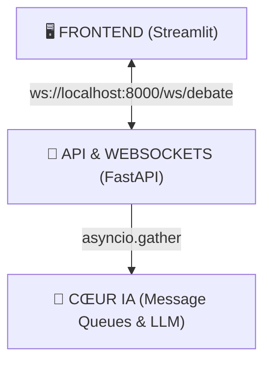

# 🧠 SYNAPSE STUDIO V3 - CONCURRENT MULTI-AGENT DEBATE
**Architecture Technique Complète**

---

## 🏗️ 1. Architecture Globale (Decouplée)

L'architecture est passée d'un processus synchrone ("un agent parle après l'autre") à une architecture asynchrone guidée par événements. Elle est structurée en 3 couches distinctes :

---

## ⚙️ 2. Le Moteur de Débat Parallèle (Le Cœur IA)

Contrairement à LangGraph (qui faisait A -> B -> C), tout le monde parle en même temps.

```mermaid
sequenceDiagram
    participant User
    participant MessageQueue
    participant Strategist (Agent)
    participant Critic (Agent)
    participant Architect (Agent)
    participant ConvergenceEngine

    User->>MessageQueue: Envoie l'idée (Prompt)
    
    rect rgb(20, 24, 33)
        Note over Strategist (Agent), Architect (Agent): Lancement en PARALLÈLE (asyncio)
        Strategist (Agent)->>MessageQueue: Récupère l'historique
        Critic (Agent)->>MessageQueue: Récupère l'historique
        Architect (Agent)->>MessageQueue: Récupère l'historique
        Strategist (Agent)-->>MessageQueue: Publie ses arguments (Round 1)
        Critic (Agent)-->>MessageQueue: Publie ses remarques (Round 1)
        Architect (Agent)-->>MessageQueue: Publie son architecture (Round 1)
    end
    
    MessageQueue->>ConvergenceEngine: Envoie les 6 réponses
    ConvergenceEngine-->>ConvergenceEngine: Calcul de la distance cosinus (Scikit-Learn/ChromaDB)
    
    alt Score < 0.88
        ConvergenceEngine->>MessageQueue: Continue (Round 2)
    else Score >= 0.88
        ConvergenceEngine->>User: Fin du débat (Consensus atteint)
    end
```

---

## 📁 3. L'Arborescence des Fichiers (Structure)

L'application est découpée intelligemment pour maintenir les rôles séparés :

*   **`main.py`** : Point d'entrée du Backend. Il démarre Uvicorn et le serveur FastAPI.
*   **`app.py`** : Point d'entrée du Frontend. Il ouvre l'interface Graphique Streamlit et écoute les WebSockets.
*   **`start_v3.bat`** : Le script utilitaire qui allume vos deux serveurs (`main.py` et `app.py`) d'un seul coup.

### Le Cerveau (`core/`)
*   **`core/orchestrator.py`** : L'automate. Gère l'`asyncio.gather` et le calcul du "Consensus" mathématique.
*   **`core/message_queue.py`** : La base de données en mémoire (RAM) qui évite que les agents se parlent dessus. Elle utilise les "Lock" asyncio.
*   **`core/embeddings.py`** : Traduit le Français/Anglais en Maths via *ChromaDB/MiniLM* pour que `Scikit-Learn` sache si les agents sont d'accord.
*   **`core/llm.py`** : Gère la connexion avec *Groq*, *DeepSeek*, *OpenRouter* de manière "Async". Retourne des flots (Streams) à la vitesse de l'éclair.

### Les Agents (`agents/`)
*   **`agents/base_agent.py`** (`ConcurrentAgent`) : Définit le système "Comment écouter les autres" puis "Comment cracher la réponse" (Classe parent).
*   **`agents/specialists.py`** : Contient les 6 classes enfants (`StrategistAgent`, `CriticAgent`...). Chacune ayant son propre prompt ("Comporte-toi comme un boss / un développeur pragmatique...")

### Le Réseau (`api/`)
*   **`api/routes.py`** : C'est le tunnel. Il prend les `print()` des Agents et les balance via `websocket.send_text()` pour qu'ils s'affichent sur l'écran Streamlit.

---

## 🚀 4. La Technologie de "Convergence" (Comment ça s'arrête ?)

1. Après chaque "Round", l'orchestrateur collecte les réponses des 6 agents.
2. `core/embeddings.py` les transforme en **Vecteurs (Listes de mille nombres décimaux)** représentant le Sens / Sémantique de leurs phrases.
3. Le Moteur utilise `sklearn.metrics.cosine_similarity` pour checker leur ressemblance.
4. Si les agents "s'alignent" (Exemple : l'Architect a patché ce que demandait le Critic, tout le monde valide l'idée du Strategist), ils finiront par sortir des mots très similaires (Consensus).
5. Passé le seuil de conformité (Fixé arbitrairement à `0.88` dans l'Orchestrator), les agents arrêtent de boucler. Un **Synthétiseur IA final** résume le Débat.
